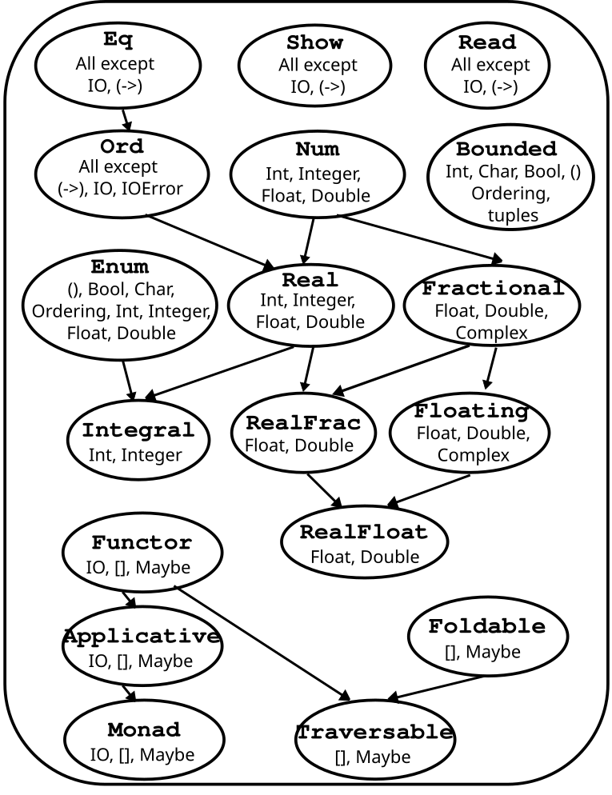

# Haskell Programming Language Notes


## Chapter 1: Introduction

Haskell saf bir fonksiyonel programlama dilidir. Klasik imperative dillerde biz bilgisayara yapması gereken bir dizi görev veririz ve bunu yapmasını bekleriz. Ancak bu görevler yerine getirilirken programda stateler veya değişkenlerin içeriği değişebilir. Fonksiyonel diller bağlamında biz bu duruma "side effect" deriz. Ayrıca bazı taskların ard arda defalarca yapılabilmesini sağlayan for, while gibi döngüsel akış kontrol yapıları vardır. 

Haskell bu şekilde çalışmaz; öncelikle bilgisayara ne yapması gerektiğini söylemezsiniz sadece nasıl yapılacağını söylersiniz, mesela bir factorial hesabı için "elde edilecek değer sayının kendisinden 1'e kadar olan tüm sayıların çarpımı şeklindedir" gibi bir tanım yapılabilir. Bu ve bunun gibi tanımlar "function"'lar ile açıklayabiliriz.

Bu dilde implemente ettiğimiz fonksiyonlar hiçbir zaman body'sinde bir değişkenin değerini değiştirmez ki pure functional tanımımız bunun yapılamıyor oluşundan gelir. Çünkü side effect istemeyiz. Fonksiyonların tek yaptığı şey bir şeyler hesaplamak ve sonucunu return etmektir. Bu durumun bir fonksiyon iki kere çağrıldığı zaman her iki seferde de aynı sonucu vereceğini garanti eder bu özelliğe "referrantial transparency" denir. Bu tür küçük küçük fonksiyonlar birleştirilerek daha kompleks ve side effect'i olmayan fonksiyonlar yaratılabilir.


>- Side effect nedir?
	Programlama dillerinde "side effect", bir fonksiyonun veya expressionun, sadece bir değer döndürmenin dışında, çağrıldığı kapsamın dışındaki bir durumu değiştirmesi veya dış dünyayla etkileşime girmesi anlamına gelir. Saf fonksiyonlar aynı girdilerle her zaman aynı çıktıyı üretirken, yan etkisi olan bir fonksiyonun davranışı dış faktörlere bağlı olarak değişebilir. Örneğin, bir fonksiyonun kendi kapsamı dışındaki global bir değişkenin değerini değiştirmesi en yaygın yan etkilerden biridir. Bir dosyaya veri yazmak, bir veritabanı sorgusu çalıştırmak, ekrana bir şey yazdırmak veya bir ağ isteği göndermek de yan etki olarak kabul edilir çünkü bu işlemler programın yerel ortamının dışındaki sistemleri etkiler.


Haskell dili ayrıca **lazy** bir özelliğe sahiptir bunun anlamı şudur; aksi belirtilmediği sürece veya ilgili fonksiyonun çalışması gerekmediği sürece fonksiyonlar yürütülmez. Yani bir nevi iş yükünü her zaman erteleme eğiliminde olan bir dildir. **Laziness** ayrıca, yalnızca sonucunu hesaplamasını istediğini bir işlemin sonucunu hesapladığı için, görünüşte sonsuz veri yapıları oluşturmanıza da olanak sağlar. 


```haskell
xs = [1, 2, 3, 4, 5, 6, 7, 8]
let lazy_result = doubleMe(doubleMe(doubleMe(xs)))
```


Imperative bir dilde bu kod satırlarından hemen sonra bellekte bu arrayin birkaç tane kopyası oluşur ve tüm verinin gerçekten de 3 kere 2 katı alınmış hali bellekte hazır tutulur. Ancak Haskell burada **Laziness** sayesinde "tamam, bana ne yapacağımı söyledin zamanı geldiğinde bunu yapacağım" der. 


```haskell
head lazy_result -- head listenin ilk elemanını veren built-in bir fonksiyondur
```


**Haskell** burada o ertelediği işi şimdi yapar ve sadece bunu ilk eleman için yapar yani `doubleMe(doubleMe(doubleMe(1)))`.


Haskell **statically typed** bir dildir, bunun anlamı compiler programı derlerken her değişkenin tipini bilir, bu sayede birçok type error derleme zamanında yakalanır. Haskell **type inference** özelliğini kullanan çok güçlü bir tip sistemi kullanır. Yani her bir kod parçası için bunun tipi budur demenize gerek yoktur, kendisi kullanılan değişkenlerin tipinden bunu çıkarabilir, ancak kullanılan değişken tipleri uyumsuzsa bu da derleme zamanı hatası olarak döner.


**GHCi Kullanımı:**

```haskell
-- arithmetic operations:
ghci> 2 + 15
17
ghci> 49 * 100
4900
ghci> 1892 - 1472
420
ghci> 5 / 2
2.5
ghci> 50 * 100 - 4999
1

-- booelan operations:
ghci> True && False
False
ghci> True && True
True
ghci> False || True
True
ghci> not False
True
ghci> not (True && True)
False
ghci> 5 == 5
True
ghci> 1 == 0
False
ghci> 5 /= 5 -- eşit değildir anlamına gelir (!= gibi)
False
ghci> 5 /= 4
True
ghci> "hello" == "hello"
True
```

Bu işlemler sadece geçerli tipler arasında yapılabilir.

---


## Chapter 2: Starting Out

### Function calls:

Haskell'de aritmetik operatörler de aslında birer fonksiyondur, tabii fonksiyon çağrıları farklı fiziksel formlarda olabilir. Mesela bir operatöre parametre verirken `infix` olarak verebiliriz: `a + b` gibi, ya da genelde olduğu gibi `prefix` olabilir: `succ 8`.

```haskell
ghci> min 9 10
9
ghci> min 3.4 3.2
3.2
ghci> max 100 101
101
```

fonksiyonlar en yüksek önceliğe sahip olur:

```haskell
-- both are equivalent
ghci> succ 9 + max 5 4 + 1
16
ghci> (succ 9) + (max 5 4) + 1
16
-- yani kısaca şöyle yazamayız:
ghci> succ 9 * 10 -- bunun sonucu 100 olur, ancak biz 9*1O'nun bir fazlasını istersek:
ghci> succ (9 * 10) -- şeklinde bir çağrı yapabiliriz
```


**A function sample:**

Burada bir fonksiyon yazmak için önce bir dosya açın (main.hs) ve içerisine şu fonksiyonu yazın, ardından terminalden bu fonksiyonu kullanabileceğiz:

```haskell
doubleMe x = x + x
doubleUs x y = x * 2 + y * 2
```

```haskell
ghci> :l main -- linking the source file
[1 of 1] Compiling Main         ( main.hs, interpreted )
Ok, modules loaded: Main.
ghci> doubleMe 9
18
ghci> doubleMe 3.2
6.4
ghci> doublUs 4 9
26
ghci> doubleUs 2.3 34.2
73.0
ghci> doubleUs 28 88 + doubleMe 123
478
```

`doubleUs` fonksiyonu şu şekilde de yazılabilirdi: `doubleUs x y = doubleMe x + doubleMe y`.  Başka bir örnek:

```haskell
doubleSmallNumber x = if x > 100
                      then x
                      else x*2
-- verilen sayı eğer 100'den büyükse çarpım yapılmaz
```

Haskell'de kullanılan her `if` için kesinlikle bir `else` de olmalıdır.


### Introduction to Lists

Haskell'de listeler homojen veri yapılarıdır yani aynı anda sadece tek tipte veriler barındırabilirler. 

```haskell
ghci> let lostNumbers = [4,8,15,16,23,42]
ghci> lostNumbers
[4,8,15,16,23,42]
```

*GHCi'de bir isim tanımlamak için let anahtar sözcüğünü kullanın. GHCi'de let a = 1 girmek, bir betiğe a = 1 yazmaya ve sonra onu :l ile yüklemeye eşdeğerdir.*

- **Concatenation:**

```haskell
ghci> [1,2,3,4] ++ [9,10,11,12]
[1,2,3,4,9,10,11,12]
ghci> "hello" ++ " " ++ "world"
"hello world"
ghci> ['w','o'] ++ ['o','t']
"woot"
```

Haskell'de stringler aslında karakter dizileri olarak saklanır: "hello" -> ['h','e','l','l','o'].

```haskell
ghci> 'A':" SMALL CAT"
"A SMALL CAT"
ghci> 5:[1,2,3,4,5]
[5,1,2,3,4,5]
```

**: (cons)** operatörü ile listenin başına da ekleme yapabiliriz. Haskell'de `[]` ifadesi empty list anlamına gelir yani şu şekilde bir şey yazılabilir: `ghci> 1:2:3:[]` bu [1, 2, 3] sonucunu üretir. 


* **Accesing list elements:**

```haskell
ghci> "Steve Buscemi" !! 6
'B'
ghci> [9.4,33.2,96.2,11.2,23.25] !! 1
33.2
```


* **Liste içinde liste:**

```haskell
ghci> let b = [[1,2,3,4],[5,3,3,3],[1,2,2,3,4],[1,2,3]]
ghci> b
[[1,2,3,4],[5,3,3,3],[1,2,2,3,4],[1,2,3]]
ghci> b ++ [[1,1,1,1]]
[[1,2,3,4],[5,3,3,3],[1,2,2,3,4],[1,2,3],[1,1,1,1]]
ghci> [6,6,6]:b
[[6,6,6],[1,2,3,4],[5,3,3,3],[1,2,2,3,4],[1,2,3]]
ghci> b !! 2
[1,2,2,3,4]
ghci> b
[[1,2,3,4],[5,3,3,3],[1,2,2,3,4],[1,2,3]]
```

görüldüğü üzere liste ile yapılan işlemler listenin kendisini değiştirmemiştir. 


* **Listeleri karşılaştırma:**

<, >, <= ve >= gibi operatörleri listeler üzerinde kullandığımız zaman lexicographic sırayla karşılaştırılırlar. 

```haskell
ghci> [3,2,1] > [2,1,0]
True
ghci> [3,2,1] > [2,10,100]
True
ghci> [3,4,2] < [3,4,3]
True
ghci> [3,4,2] > [2,4]
True
ghci> [2] > [1, 100]
True
ghci> [3,4,2] == [3,4,2]
True
```


* **Other List Operations:**

```haskell
ghci> head [5,4,3,2,1]
5
ghci> tail [5,4,3,2,1]
[4,3,2,1]
ghci> last [5,4,3,2,1]
1
ghci> init [5,4,3,2,1] # everything except last elem
[5,4,3,2]
ghci> head []
*** Exception: Prelude.head: empty list
ghci> length [5,4,3,2,1]
5
ghci> null [1,2,3]
False
ghci> null []
True
ghci> reverse [5,4,3,2,1]
[1,2,3,4,5]
ghci> take 3 [5,4,3,2,1]
[5,4,3]
ghci> take 1 [3,9,3]
[3]
ghci> take 5 [1,2]
[1,2]
ghci> take 0 [6,6,6]
[]
-- t drops the specified number of elements from the beginning of a list:
ghci> drop 3 [8,4,2,1,5,6]
[1,5,6]
ghci> drop 0 [1,2,3,4]
[1,2,3,4]
ghci> drop 100 [1,2,3,4]
[]
ghci> maximum [1,9,2,3,4]
9
ghci> minimum [8,4,2,1,5,6]
1
ghci> sum [5,2,1,6,3,2,5,7]
31
ghci> product [6,2,1,2]
24
ghci> product [1,2,5,6,7,9,2,0]
0
-- elem genelde infix olarak kullanılır, Haskell'de çift operatörlü fonksiyonların infix formu şu şekilde kullanılır:
ghci> 4 `elem` [3,4,5,6] -- ghci> elem 4 [3,4,5,6] esdeger
True
ghci> 10 `elem` [3,4,5,6]
False
```


**Ranges:**

Enumerate edilebilen verileri bazen direkt olarak bir arrayın içine yazmaktansa derleyici tarafından doldurulmasını bekleyebiliriz. Haskell'de bunun için **range** kullanılır. Aşağıdaki örneklerden bunu anlayabiliriz:

```haskell
ghci> [1..20]
[1,2,3,4,5,6,7,8,9,10,11,12,13,14,15,16,17,18,19,20]
ghci> ['a'..'z']
"abcdefghijklmnopqrstuvwxyz"
ghci> ['K'..'Z']
"KLMNOPQRSTUVWXYZ"
```

burada ilk sayıdan son sayıya kadar tüm elemanlar sıralanır, ayrıca aşağıdaki gibi durma noktası da belirtebiliriz. Burada; ilk parametre örüntünün ilk elamanını, ikinci parametre ikinci elemanını belirtirken son parametre de dizinin sınırını belirler. 

```haskell
ghci> [2,4..20]
[2,4,6,8,10,12,14,16,18,20]
ghci> [3,6..20]
[3,6,9,12,15,18]
```

Tabii range kullanımında derleyici her kompleks örüntüyü anlayıp buna göre devamını dolduramaz, yukarıda verdiğimiz gibi aritmetik örüntülerde kullanılır. 

---

> **Not:** 20'den 1'e kadar sayıları elde etmek istediğinizde bunu `[20..1]` şeklinde yazmamalıyız, çünkü derleyicinin yaptığı ilk işlemlerden biri verilen sayıların ilkinin birincisinden büyük olup olmamasıdır. Böyle bir durumda direkt boş bir liste elde ederiz. İstediğimizi yapabilmek için ` [20,19..1]` gibi bir direktif vermeliyiz.

---

Diyelim ki 13'ün ilk 24 katını veren bir dizi oluşturmak istiyoruz, bunu yapabilmek için şöyle bir şey yazabiliriz:

```haskell
ghci> [13,26..24*13]
[13,26,39,52,65,78,91,104,117,130,143,156,169,182,195,208,221,234,247,260,273,286,299,312]
```

ancak daha efektif bir yöntem sonsuz liste kullanmaktır, Haskell lazy evaluation yaptığı için sadece istediğiniz yere kadar olan kısmı işler:

```haskell
ghci> take 24 [13,26..]
[13,26,39,52,65,78,91,104,117,130,143,156,169,182,195,208,221,234,247,260,273,286,299,312]
```

Aşağıda çok uzun ve sonsuz listeler için kullanılan bazı fonksiyonlar verilmiştir:

* `cycle`:

```haskell
ghci> take 10 (cycle [1,2,3])
[1,2,3,1,2,3,1,2,3,1]
ghci> take 12 (cycle "LOL ")
"LOL LOL LOL "
```

* `repeat`:

```haskell
ghci> take 10 (repeat 5)
[5,5,5,5,5,5,5,5,5,5]
```

* `replicate`:

```haskell
ghci> replicate 3 10
[10,10,10]
```


### List Comprehensions

List comprehension (liste sıkıştırma), listeleri filtreleme, dönüştürme ve birleştirme işlemlerini yapabilmemizi sağlayan bir yoldur. Matematikteki `set comprehensions` kavramına çok benzerdir, zaten Haskell'in amacı matematiksel bir saflığa yakın olmak olduğundan bu durum doğal karşılanabilir. 

Matematikte basit bir küme oluşturma işlemi:

```mathematica
{2 · x | x ∈ N, x ≤ 10}
```

yani burada "10 ve 10'dan küçük tüm doğal sayıları al ve bunları 2 ile çarparak kümeme ekle" işlemi yaptırılmaya çalışılıyor. Haskell'de buna benzer bir şey yapabilmek için önceki sayfalarda gördüğümüz gibi range kullanabiliriz:

```haskell
take 10 [2,4..]
```

ancak, list comprehensionın bu durumda tercih edilmesi daha efektiftir, çünkü daha kompleks işlemleri de daha kolay yaptırabilir.

```haskell
ghci> [x*2 | x <- [1..10]]
[2,4,6,8,10,12,14,16,18,20]
```

Bu satırda aslında şunu demek istiyoruz:

1) Kullanacağımız elemanlar **[1..10]** listesi olacak.
2) **x <- [1..10]** bu verdiğim listeyi gez ve her döngüde current elemanı x'in içine koy.
3) Pipe (|) operatöründen önceki kısım da bizim outputumuzu kurduğumuz yer olacak, **x** ile aldığımız her elemanı 2 ile çarp ve listeye ekle.

Bu yöntem ilkinden daha karmaşık görünebilir ancak daha kompleks işlemleri yapabilmek için range veya benzer kullanımlar bizi kurtaramaz. Mesela listeyi ilk oluşturduğumuz kısıma condition'lar (buna ayrıca **predicate** denir) ekleyip listeleri daha karmaşık şekillerde oluşturabiliriz. Bu condition'lar listenin en sonuna yazılır ve diğer kısımlardan virgülle ayrılır.

```haskell
ghci> [x*2 | x <- [1..10], x*2 >= 12]
[12,14,16,18,20]
```

burada programdan sadece 2 ile çarpımı 12'den büyük olan sayıları output'a eklemesini istiyoruz. Ya da belki sadece 7 ile modu 3 olan sayılar olsun isteyebiliriz:

```haskell
ghci> [ x | x <- [50..100], x `mod` 7 == 3]
[52,59,66,73,80,87,94]
```

Listeleri **predicate**'ler kullanarak ayırmaya filtreleme denir. 


Aşağıda bazı daha detaylı örnekler verilmiştir:

```haskell
boomBangs xs = [ if x < 10 then "BOOM!" else "BANG!" | x <- xs, odd x]
```

burada elimizde `xs` adında bir liste olduğunu düşünelim, bu listedeki tek olan elemanların yerine 10'dan büyük veya küçük olması ilişkilerine göre "BOOM" veya "BANG" yazdırıyoruz. 

```haskell
ghci> xs =  [1..15]
ghci> boomBangs xs
["BOOM!","BOOM!","BOOM!","BOOM!","BOOM!","BANG!","BANG!","BANG!"]
```

Comprehension ifadesinin içine birden fazla **predicate** yazabiliriz:

```haskell
ghci> [ x | x <- [10..20], x /= 13, x /= 15, x /= 19]
[10,11,12,14,16,17,18,20]
```

Sadece tek listeyle değil aynı anda birden fazla liste kullanarak da bu ifadeleri yazabiliriz. Aşağıda buna yönelik örnekler verilmiştir. 

```haskell
ghci> [x+y | x <- [1,2,3], y <- [10,100,1000]]
[11,101,1001,12,102,1002,13,103,1003]
```

burada her iki listedeki elemanları teker teker x ve y ile dolaşır ardından bunları toplayıp yeni listeye atarız. Tüm kombinasyonların uygulandığına dikkat ediniz. Stringler üzerinden bir örnek:

```haskell
ghci> let nouns = ["hobo","frog","pope"]
ghci> let adjectives = ["lazy","grouchy","scheming"]
ghci> [adjective ++ " " ++ noun | adjective <- adjectives, noun <- nouns]
["lazy hobo","lazy frog","lazy pope","grouchy hobo","grouchy frog",
"grouchy pope","scheming hobo","scheming frog","scheming pope"]
```


**List Comprehension ile kendi Length fonksiyonumu yazma:**

```haskell
length' xs = sum [1 | _ <- xs]
```

xs'in her elemanını al ve değeri farketmeksizin (_) bunun için sıkıştırdığımız listeye bir tane 1 ekle, ardından `sum` ile tüm listenin elemanlarını topla. Burada `_` ifadesini bir geçici değişken olarak kullanıyoruz, aslında başka bir şekilde de bunu alabilirdik listeden ancak her eleman için aynı işlemi yapacağımızdan dolayı buna gerek olmadan sadece varlık kontrolü yapıyoruz.


**Örnek:**

```haskell
removeNonUppercase st = [ c | c <- st, c `elem` ['A'..'Z']]
```

```haskell
ghci> removeNonUppercase "Hahaha! Ahahaha!"
"HA"
ghci> removeNonUppercase "IdontLIKEFROGS"
"ILIKEFROGS"
```

iç içe listelerde de aşağıdaki gibi kullanılabilir:

```haskell
ghci> let xxs = [[1,3,5,2,3,1,2,4,5],[1,2,3,4,5,6,7,8,9],[1,2,4,2,1,6,3,1,3,2,3,6]]
ghci> [ [ x | x <- xs, even x ] | xs <- xxs]
[[2,2,4],[2,4,6,8],[2,4,2,6,2,6]]
```

comprehension ifadesinin dış kısmında içerideki listeleri dolaş, içerideki diğer listede de her bir iç liste üzerinde çalış. 

---

Çok uzun olabilecek comprehension ifadelerini kod yazarken okunabilirlik artabilsin diye satırlara ayırabilirsiniz. 

```haskell
boomBang out = [ if x < 10 then "BOOM!" else "BANG!" | 
                 x <- [0..15], 
                 odd x ]
```

---


### Tuples (demet)

Tuple'lar birkaç heterojen elementi bir tekil değer gibi tutmamızı sağlayan veri yapılarıdır. Listelerden en büyük farkları heterojen olabilmelidir ayrıca boyutları katı bir şekilde sabittir.

```haskell
ghci> (1, 3)
(1,3)
ghci> (3, 'a', "hello")
(3,'a',"hello")
ghci> (50, 50.4, "hello", 'b')
(50,50.4,"hello",'b')
```

Tuple'lar görünürde listelere benzese de aralarında önemli farklılıklar vardır mesela iki boyutlu bir düzlem için bir koordinat sistemi kullanmak istiyorurz diyelim. Bunun için her nokta için hem x hem de y'yi tutan bir veri yapısına ihtiyacımız var, burada hem liste hem de tuple kullanacağımız senaryolara bakalım:

Liste kullanırsak şöyle bir şeyler olur: `[[1,2],[8,11],[4,5]]` ve bu veri yapısının tanımı (daha teknik olarak *tip*i) **list of lists** olarak yapılır. Ancak `[[1,2],[8,11,5],[4,5]]` listesi de aynı şekilde tanımlanır... Unutmamalıyız ki Haskell'in en önemli özelliklerinden biri tip sistemi üzerine yoğunlaşmasıdır; bu, fonksiyon yazmamızı, vektörleri ve shape'leri manipüle etmemizi zorlaştırır dolayısııyla bu tarz bir durum isteyeceğimiz bir durum değildir. Tersine **tuple**'larda boyut değiştikçe veri yapısının tipi de değişir, mesela ikili çiftler barındıran tuple'lara `pair` denirken üç eleman tutan tuple'lara `triple` denir.

* Listeler ile:

```haskell
ghci> [[1,2],[8,11,5],[4,5]]
[[1,2],[8,11,5],[4,5]]
```

görüldüğü üzere içerideki değerler aslında farklı olmasına rağmen bir tip hatası vermedi çünkü her bir koordinat noktasını burada **list of lists** olarak görüyor.

* Tuple'lar ile:

```
ghci> [(1,2),(8,11,5),(4,5)]
Couldn't match expected type `(t, t1)'
against inferred type `(t2, t3, t4)'
In the expression: (8, 11, 5)
In the expression: [(1, 2), (8, 11, 5), (4, 5)]
In the definition of `it': it = [(1, 2), (8, 11, 5), (4, 5)]
```

ancak burada ortadaki nokta bir triple iken diğer ikisi pair olduğu için bir tip hatası üretiyor. Unutmayın ki listeler her zaman tek bir tür barındırabilir, aslında tamamen anlatmaya çalıştığımız şey bu. Bir tuple boyutuna göre farklı tiplere bürünür, bu tarz senaryolarda hangi veri yapılarını kullanacağımızı özenle seçmeliyiz. Ayrıca `[(1,2),("One",2)]` gibi bir kullanım da hata verecektir, burada boyutlardan ziyade tuple 'ların tuttuğu iç değerlerin tipi farklıdır. Doğal olarak bu tuple'ın kendi tipine de etki eder.

Listeler gibi, bileşenleri karşılaştırılabiliyorsa tuple'lar birbirleriyle karşılaştırılabilir. Ancak, listelerin aksine, farklı boyutlardaki iki tuple'ı karşılaştıramazsınız. Singleton list olsa da tuple'lar da böyle bir özellik yoktur. 

**Using Pairs:**

```haskell
ghci> fst (8, 11)
8
ghci> fst ("Wow", False)
"Wow"
```

`fst` bize tuple'ın ilk elemanını verir. `snd` de ikinci elemanını verir:

```haskell
ghci> snd (8, 11)
11
ghci> snd ("Wow", False)
False
```

unutmamalıyız ki bu iki operatör sadece **pair**'ler için çalışır. Aksi halde:

```haskell
ghci> fst (8, 11, 15)

<interactive>:22:5: error:
    • Couldn't match expected type: (a, b0)
                  with actual type: (a0, b1, c0)
    • In the first argument of ‘fst’, namely ‘(8, 11, 15)’
      In the expression: fst (8, 11, 15)
      In an equation for ‘it’: it = fst (8, 11, 15)
    • Relevant bindings include it :: a (bound at <interactive>:22:1)
```


**zip** fonksiyonu kullanılarak iki liste birleştirilerek bir tuple listesi oluşturulabilir:

```haskell
ghci> zip [1,2,3,4,5] [5,5,5,5,5]
[(1,5),(2,5),(3,5),(4,5),(5,5)]
ghci> zip [1..5] ["one", "two", "three", "four", "five"]
[(1,"one"),(2,"two"),(3,"three"),(4,"four"),(5,"five")]
```

değişik boyutta listeleri input olarak verdiğimizde daha küçük boyutta olan listeyi dikkate alır geriye kalan elemanları işlemez:

```haskell
ghci> zip [1,2,3,4,6,5] [5,5,5,5,5]
[(1,5),(2,5),(3,5),(4,5),(6,5)]
```

Pratik bir örnek:

```haskell
ghci> zip [1..] ["apple", "orange", "cherry", "mango"]
[(1,"apple"),(2,"orange"),(3,"cherry"),(4,"mango")]
```

```haskell
ghci> let rightTriangles' = [ (a,b,c) | c <- [1..10], a <- [1..c], b <- [1..a], a^2 + b^2 == c^2, a+b+c == 24]
ghci> rightTriangles' 
[(8,6,10)]
```

istenen özel 6-8-10 üçgenini bulan bir Haskell fonksiyonu.

---


## Chapter 3: Type System

Haskell'in en güçlü yönlerinden biri tip sistemidir. Haskell'de tüm expressionların tipi derleme zamanında belirlenir. Bu, daha daha güvenli kod yazımını sağlar. Diğer dillerdeki gibi örneğin kullanacağımız bir sayı için bir tip belirtmek zorunda değiliz. Haskell'in **type inference** özelliği kullanılan bağlama göre değişkenin tipini çıkarabilir. 

**Explicit Type Decleration:** GHCi ile komut satırından herhangi bir expression için tip çıkarımını yapmak için `:t` komutunu kullanabiliriz, aşağıdaki örnekleri inceleyiniz:

```haskell
ghci> :t 'a'
'a' :: Char
ghci> :t True
True :: Bool
ghci> :t "HELLO!"
"HELLO!" :: [Char]
ghci> :t (True, 'a')
(True, 'a') :: (Bool, Char)
ghci> :t 4 == 5
4 == 5 :: Bool
```

Haskell'de fonksiyonların da tipleri vardır, fonksiyonlar yazılırken explicit type decleration da yapılabilir. Bu, genellikle önerilen bir pratiktir. Şöyle bir örnek üzerinden inceleyelim:

```haskell
removeNonUppercase :: [Char] -> [Char]
removeNonUppercase st = [ c | c <- st, c `elem` ['A'..'Z']]
```

buradaki ilk ifadede fonksiyonun **type signature**'ı gösterilir. `::` operatörü ... fonksiyonu ... tipindedir anlamına gelir. `->` operatörünün sol kısmı input tiplerini, sağ kısmı da output tipini belirtir.

```haskell
addThree :: Int -> Int -> Int -> Int
addThree x y z = x + y + z
```

Buradaki gibi birden fazla `->` operatörü bulunan fonksiyonlarlar karşılaşabilirsiniz, bunlar **currying** denilen bir mekanizmayla açıklanmaktadır. Haskell'deki çoklu argüman alan tüm fonksiyonlar, aslında bu şekilde tek tek argüman alarak kısmen uygulanabilen **(partially applied)** fonksiyonlar zinciri olarak çalışır. Bu daha sonra ele alacağımız bir konudur. 


> Haskell'de tip imzaları, kodun ne yapacağı hakkında önemli bilgiler sunar ve kod tabanını daha sağlam hale getirir. Fonksiyonların tiplerini açıkça belirtmek, programcıların kod hakkında düşünme biçimini de geliştirir, çünkü fonksiyonların veri akışını ve dönüşümünü net bir şekilde görmelerini sağlar.


```haskell
ghci> :l deneme.hs
[1 of 2] Compiling Main             ( deneme.hs, interpreted )
Ok, one module loaded.
ghci> :t removeNonUppercase 
removeNonUppercase :: [Char] -> [Char]
```

---


### Common Haskell Types

* **Int**, çoğu dildeki temel **int** tipinin karşılığıdır, makinenin modeline göre bu tipin alabileceği minimum ve maximum değerler değişebilir. Örneğin 64-bit bir CPU bulunduran bir makine için **Int** türünün alabileceği değer aralığı, (−2<sup>63</sup>, 2<sup>63</sup>)'dir.

* **Integer**, normal Int gibidir ancak Int'te olduğu gibi fiziksel bir sınırlama yoktur:

```haskell
factorial :: Integer -> Integer
factorial n = product [1..n]
```

burada gerçekten çok çok büyük sayılar tutulabilir. Bu, Haskell'in matematikteki gücü için kuşkusuz bir ihtiyaçtır. 

```haskell
ghci> factorial 50
30414093201713378043612608166064768844377641568960512000000000000
```

* **Float**, tek duyarlıklı bir floating point sayı tipidir:

```haskell
circumference :: Float -> Float
circumference r = 2 * pi * r
```

```haskell
ghci> circumference 4.0
25.132742
```

* **Double**, Float tipinin 2 katı kadar bit kullanarak daha fazla hassasiyet sağlar:

```haskell
circumference' :: Double -> Double
circumference' r = 2 * pi * r
```

```haskell
ghci> circumference' 4.0
25.132741228718345
```

* **Bool**, sadece **True** ve **False** değerlerini alabilen temel bir mantıksal türdür.
* **Char**, tek tırnak işaretleri arasında tanımlanan ve unicode karakterlerini temsil edebilen bir türdür.
* **Tuple**'lar da birer türdür, ancak tanımları uzunluklarına ve bileşenlerinin türlerine bağlıdır. Dolayısıyla, teorik olarak sonsuz sayıda Tuple türü vardır. (Pratikte, Tuple'lar en fazla 62 öğeye sahip olabilir) Boş Tuple'ın () de bir tür olduğunu ve yalnızca tek bir değere sahip olabileceğini unutmayın: ().

---


### Type Variables (Tip değişkenleri)

**head** fonksiyonunu düşündüğümüzde parametre olarak aldığı listenin elemanların tipi farketmeksizin listenin ilk elemanını döndürür. Peki böyle bir fonksiyonun imzası nasıl olabilir? GHCi ile bunu test edelim:

```Haskell
ghci> :t head
head :: [a] -> a
```

Burada `a` nedir? Unutmayın Haskell'de tip isimleri her zaman büyük harflerler başlar, dolayısıyla bunun bir tip olmayacağını çıkarabiliriz. Bu, aslında herhangi bir tip olabileceğini belirten bir **type variables** örneğidir.

> **Type variables**, fonksiyonların değişken tipte olabileceği verilerle type-safe işlemler yapabilmesini sağlar. Bu, diğer programlama dillerindeki **generics** kavramına benzerdir. Ancak, Haskell versiyonu bize çok daha genel fonksiyonlar yazabilmemize olanak sağladığı için çok daha güçlüdür. 

> **Type variables** kullanan fonksiyonlara **polymorphic functions** denir. Type variables bir karakterden uzun isimlere sahip olabilse de, genellikle onlara a, b, c, d vb. isimler veririz.


* `fst` fonksiyonunu tekrar hatırlayalım; fst bir pair bir tuple'ı girdi olarak alan ve ilk elemanını döndüren bir fonksiyondu:

```haskell
ghci> :t fst
fst :: (a, b) -> a
```

Yani burada tuple'ın elemanlarının herhangi bir tipte olabileceği, a ve b ile belirtilmiştir.

---


### Type Classes (Tip Sınıfları)

Bir tür sınıfı, bazı davranışları tanımlayan bir arayüzdür. Bir tür, bir tür sınıfının örneğiyse, tür sınıfının tanımladığı davranışı destekler ve uygular. Dahası, bir tip sınıfı birtakım fonksiyonlar yığını kümesidir, bu sınıftan bir tip örneği yaratmak istediğimizde bu fonksiyon kümesindeki her bir fonksiyonun bu tip içiç karşılığını tanımlarız.

- Eşitlik için kullanılan tip sınıfı bu konu için iyi bir örnektir.

```haskell
ghci> :t (==)
(==) :: (Eq a) => a -> a -> Bool
```

> **Not:** Haskell'de operatörlerin de birer fonksiyon olduğunu unutmayın.

Burada ilk kez karşılaştığımız `=>` sembolünü şu şekilde açıklayabiliriz: bu sembolden önceki her şey bir **class constraint**'tir (sınıf kısıtı). Yani yukarıdaki çıktıyı şu şekilde okuyabiliriz, eşitlik fonksiyonu aynı türde iki değer alır ve bir **Bool** döndürür. Bu iki değerin türü, **Eq** sınıfının bir örneği olmalıdır. Daha açık bir şekilde söylemek gerekirse, Eq sınıfı karşılaştırılabilir tiplerin bir arayüzünü temsil eder diyebiliriz. Tüm standart Haskell tipleri bu sınıfa aittir (I/O tipleri ve fonksiyonları hariç). 

> Tip sınıflarının, nesne yönelimli programlama dillerindeki sınıflarla aynı olmadığını belirtmek önemlidir.


**Bazı önemli Type Class'lar:**

* **The Eq Type Class:**

Daha önce de tartıştığımız gibi, **Eq** eşitlik testini destekleyen türler için kullanılır. Örneklerinin uyguladığı fonksiyonlar `==` ve `/=`'dir. Bu, bir işlevdeki bir tür değişkeni için bir **Eq** sınıf kısıtlaması varsa, tanımının içinde bir yerde `==` veya `/=` kullandığı anlamına gelir.

```haskell
ghci> 5 == 5
True
ghci> 5 /= 5
False
ghci> 'a' == 'a'
True
ghci> "Ho Ho" == "Ho Ho"
True
ghci> 3.432 == 3.432
True
```


* **The Ord Type Class:**

Ord, değerleri belirli bir sıraya konulabilen türler için bir tür sınıfıdır. Örneğin, büyüktür (>) operatörünün türüne bakalım:

```haskell
ghci> :t (>)
(>) :: (Ord a) => a -> a -> Bool
```

Şimdiye kadar ele aldığımız tüm tipler (yine fonksiyonlar hariç) Ord'un örnekleridir. Ord, >, <, >= ve <= gibi tüm standart karşılaştırma fonksiyonlarını kapsar.

> **compare** fonksiyonu, türü Ord örneği olan iki değer alır ve bir Ordering döndürür. Ordering, sırasıyla büyük, küçük veya eşit anlamına gelen GT, LT veya EQ olabilen bir türdür.

```haskell
ghci> "Abrakadabra" < "Zebra"
True
ghci> "Abrakadabra" `compare` "Zebra"
LT
ghci> 5 >= 2
True
ghci> 5 `compare` 3
GT
ghci> 'b' > 'a'
True
```


* **The Show Type Class:**

Türleri Show tür sınıfının örnekleri olan değerler stringler olarak temsil edilebilir. Şimdiye kadar ele aldığımız tüm türler (fonksiyonlar hariç) Show'un örnekleridir. Bu tür sınıfının örnekleri üzerinde çalışan en yaygın kullanılan fonksiyon, verilen değeri bir dize olarak yazdıran show'dur:

```haskell
ghci> show 3
"3"
ghci> show 5.334
"5.334"
ghci> show True
"True"
```


* **The Read Type Class:**

Read, Show'un zıt tip sınıfı olarak düşünülebilir. Yine, şimdiye kadar ele aldığımız tüm tipler bu tip sınıfının örnekleridir. Read fonksiyonu bir string alır ve türü Read'in bir örneği olan bir değer döndürür:

```haskell
ghci> read "True" || False
True
ghci> read "8.2" + 3.8
12.0
ghci> read "5" - 2
3
ghci> read "[1,2,3,4]" ++ [3]
[1,2,3,4,3]
```

Şimdiye kadar her şey yolunda. Peki "4" değerini girmeye çalışırsak ne olur?

```haskell
ghci> read "4"
<interactive>:1:0:
	Ambiguous type variable 'a' in the constraint:
		'Read a' arising from a use of 'read' at <interactive>:1:0-7
	Probable fix: add a type signature that fixes these type variable(s)
```

Burada, **read** expression içindeki kullandığımız bağlama uygun bir şekilde çevirme işlemini yapmaya çalışır. Bu örnekte nereye bakacağını anlayamayacağı için böyle bir hata verir, şimdi **read**'in imzasına bakalım:

```haskell
ghci> :t read
read :: (Read a) => String -> a
```

> String, [Char] için kullanılan başka bir isimdir. String ve [Char] birbirinin yerine kullanılabilir, ancak bundan sonra çoğunlukla String kullanmaya devam edeceğiz çünkü yazması daha kolay ve daha okunabilir.

* Bir expression belirtmeden elimizdeki String'i istediğimiz bir türe çevirmek için **type annotations** dediğimiz mekanizmayı kullanmalıyız:

```haskell
ghci> read "5" :: Int
5
ghci> read "5" :: Float
5.0
ghci> (read "5" :: Float) * 4
20.0
ghci> read "[1,2,3,4]" :: [Int]
[1,2,3,4]
ghci> read "(3, 'a')" :: (Int, Char)
(3, 'a')
```

Compiler çoğu zaman kendi başına tipleri tespit etmeye çalışır (type inference) ancak bu gibi bazı durumlarda bağlamı kavrayamaz, bunu çözmek için bizim özellikle ne istediğimizi belirtmemiz gerekir.

> ```haskell
> ghci> [read "True", False, True, False]
> [True, False, True, False]
> ```
>
> örneğin burada bir **Bool** list içerisinde bir read expression kullanıp fazladan hiçbir bilgi vermememize rağmen Haskell'in type inference mekanizması, listenin Bool türden olduğunu tespit ettiğini ve conversion'ı ona göre yaptığını görebiliriz.


* **The Enum Type Class:**

Enum örnekleri sıralı türlerdir; değerleri numaralandırılabilir. Enum tür sınıfının temel avantajı, değerlerini liste aralıklarında kullanabilmemizdir. Ayrıca, succ ve pred işlevleriyle elde edebileceğimiz tanımlanmış ardılları ve öncülleri de vardır. Bu sınıftaki türlere örnek olarak (), Bool, Char, Ordering, Int, Integer, Float ve Double verilebilir.

```haskell
ghci> ['a'..'e']
"abcde"
ghci> [LT .. GT]
[LT,EQ,GT]
ghci> [3 .. 5]
[3,4,5]
ghci> succ 'B'
'C'
```

```haskell
ghci> :t [3..5]
[3..5] :: (Num a, Enum a) => [a]
```

yani a türü hem bir sayı olmalı hem de enumerable olmalı ki istenilen şekilde bir liste üretilebilsin. `=>` sembolünden önceki kısma bu yüzden "class constaraints" denir.


* **The Bounded Type Class:**

Bounded tip sınıfının örneklerinin bir üst ve bir alt sınırı vardır ve bu, minBound ve maxBound fonksiyonları kullanılarak kontrol edilebilir:

```haskell
ghci> minBound :: Int
-2147483648
ghci> maxBound :: Char
'\1114111'
ghci> maxBound :: Bool
True
ghci> minBound :: Bool
False
```

ayrıca Tuple'larla da şu şekilde kullanılabilir:

```haskell
ghci> maxBound :: (Bool, Int, Char)
(True,2147483647,'\1114111')
```


* **The Num Type Class:**

Num numerik bir tip sınıfıdır. Onun örnekleri bir sayı gibi davranır.

```haskell
ghci> :t 20
20 :: (Num t) => t
```

Tam sayıların da polimorphic constants olduğu anlaşılıyor. Num tür sınıfının (Int, Integer, Float veya Double) bir örneği olan herhangi bir tür gibi davranabilirler:

>polimorphic constants ile **değeri veya davranışı sabit olan, ancak tipi bağlama göre değişebilen (polimorfik olan) bir ifadeyi veya değeri** kastediyoruz. Bu, sabitin kendisinin (expression'ın) değil, onun temsil ettiği değerin veya fonksiyonun tanımının sabit olduğu, ancak tipinin esnek olduğu anlamına gelir.

```haskell
ghci> 20 :: Int
20
ghci> 20 :: Integer
20
ghci> 20 :: Float
20.0
ghci> 20 :: Double
20.0
```

```haskell
ghci> :t (*)
(*) :: (Num a) => a -> a -> a
```

Bu, ***** fonksiyonunun iki sayı kabul ettiğini ve aynı türde bir sayı döndürdüğünü gösterir. Bu tür kısıtlaması nedeniyle, `(5 :: Int) * (6 :: Integer)` bir tür hatasına neden olurken, `5 * (6 :: Integer)` sorunsuz çalışacaktır. 5, hem **Integer** hem de **Int** gibi davranabilir, ancak aynı anda ikisi birden olamaz. **Num**'ın bir örneği olması için, bir türün **Show** ve **Eq**.'da zaten bulunması gerekir.


* **The Floating Type Class:**

Floating tür sınıfı, kayan nokta sayılarını depolamak için kullanılan Float ve Double türlerini içerir. Floating tür sınıfının örnekleri olan değerleri alıp döndüren fonksiyonların, anlamlı hesaplamalar yapabilmeleri için sonuçlarının kayan nokta sayıları ile temsil edilmesi gerekir. Bazı örnekler sin, cos ve sqrt'dir.


* **The Integral Type Class:**

**Integral**, başka bir sayısal tür sınıfıdır. **Num**, gerçek sayılar da dahil olmak üzere tüm sayıları içerirken, **Integral** sınıfı yalnızca tam sayıları içerir. Bu tür sınıfı, **Int** ve **Integer** türlerini içerir. Sayılarla başa çıkmak için özellikle kullanışlı bir fonksiyon **fromIntegral**'dir. Aşağıdaki tür bildirimine sahiptir:

```haskell
fromIntegral :: (Num b, Integral a) => a -> b
```
Bu imza bize şunları anlatır:

* **a:** Fonksiyonun aldığı girişin tipidir. Integral a kısıtlaması, a'nın bir tamsayı tipi (Int, Integer gibi) olması gerektiğini söyler.

* **b:** Fonksiyonun döndürdüğü çıktının tipidir. Num b kısıtlaması, b'nin herhangi bir sayısal tip (Int, Float, Double gibi) olabileceğini belirtir.

* **=>:** Bu işaret, tip kısıtlamalarını fonksiyondan ayırır. Parantez içindeki (Num b, Integral a) kısmı, a ve b tipleri için gerekli olan koşulları gösterir.

Kısacası, **fromIntegral** bir tamsayıyı alır ve onu, bağlama uygun başka bir sayısal tipe (genellikle bir ondalıklı sayıya) dönüştürür.


> **fromIntegral**'in tür imzasında birkaç sınıf kısıtlaması olduğuna dikkat edin. Bu tamamen geçerlidir; birden fazla sınıf kısıtlaması parantez içinde virgülle ayrılmıştır.


Tür imzasından, **fromIntegral**'in bir tam sayıyı alıp daha genel bir sayıya dönüştürdüğünü görebiliriz. Bu, tam sayı ve kayan nokta türlerinin birlikte sorunsuz çalışmasını istediğinizde çok kullanışlıdır. Örneğin, length fonksiyonunun şu tür bildirimi vardır:

```haskell
length :: [a] -> Int
```

Bu, bir listenin uzunluğunu alıp 3.2'ye eklemeye çalışırsak bir hata alacağımız anlamına gelir (çünkü bir kayan noktalı sayıya bir Int eklemeye çalıştık). Bunu aşmak için fromIntegral'i şu şekilde kullanabiliriz:

```haskell
ghci> fromIntegral (length [1,2,3,4]) + 3.2
7.2
```


Bir **type class** soyut bir arayüz tanımladığı için, bir tür birçok tür sınıfının örneği olabilir ve bir tür sınıfı birçok türe örnek olarak sahip olabilir. Örneğin, **Char** türü birçok tür sınıfının örneğidir; bunlardan ikisi **Eq **ve **Ord**'dur, çünkü iki karakterin eşit olup olmadığını kontrol edebilir ve alfabetik sırayla karşılaştırabiliriz. Bazen bir türün, başka bir tür sınıfının örneği olabilmesi için önce bir tür sınıfının örneği olması gerekir. Örneğin, **Ord** örneği olması için, bir türün önce **Eq** örneği olması gerekir. Başka bir deyişle, **Eq** örneği olmak, **Ord** örneği olmanın ön koşuludur. Düşündüğünüzde bu mantıklı geliyor, çünkü iki şeyi sıralamak için karşılaştırabiliyorsanız, bu şeylerin eşit olup olmadığını da anlayabilmelisiniz.


**Haskell'deki Type Class Hiyerarşisi:**




## Chapter 4: Syntax in Functions


### Pattern Matching

Pattern matching, bazı verilerin uyması gereken desenleri belirtmek ve verileri bu desenlere göre çözümlemek için kullanılır. Haskell'de fonksiyonlar tanımlarken, farklı patternler için ayrı fonksiyon gövdeleri oluşturabilirsiniz. Bu, basit ve okunabilir bir koda yol açar. Hemen hemen her veri türünde pattern matching yapabilirsiniz.


Örneğin, kendisine geçirdiğimiz sayının 7 olup olmadığını kontrol eden basit bir fonksiyon yazalım:
```haskell
lucky :: Int -> String
lucky 7 = "LUCKY NUMBER SEVEN!"
lucky x = "Sorry, you're out of luck, pal!"
```

`Lucky`'yi çağırdığımızda patternler yukarıdan aşağıya doğru kontrol edilir. İlk eşleşen pattern'in gövdesi çalışıtırılacak kısım olarak seçilir.

​	Desenimizde gerçek bir değer (örneğin 7) yerine küçük harfle başlayan bir ad (örneğin x, y veya myNumber) kullandığımızda, bu bir **catchall pattern** (genel desen) işlevi görecektir. Bu desen her zaman verilen değerle eşleşecek ve bu değere desen için kullandığımız adla atıfta bulunabileceğiz.

​	Örnek fonksiyon, bir if ifadesi kullanılarak da kolayca uygulanabilirdi. Peki ya bir sayıyı alıp, 1 ile 5 arasındaysa kelime olarak yazdıran; aksi takdirde "1 ile 5 arasında değil" yazdıran bir fonksiyon yazmak isteseydik? Pattern matching olmadan, oldukça karmaşık bir if/then/else ağacı oluşturmamız gerekirdi. Ancak pattern matching, bunu yazmayı basit bir fonksiyon haline getirir:

```haskell
sayMe :: Int -> String
sayMe 1 = "One!"
sayMe 2 = "Two!"
sayMe 3 = "Three!"
sayMe 4 = "Four!"
sayMe 5 = "Five!"
sayMe x = "Not between 1 and 5"
```

`sayMe x` kısmını en üste taşıdığımızda her zaman `Not between 1 and 5` çıktısını alacağımızı unutmayın. 

```haskell
factorial :: Int -> Int
factorial 0 = 1
factorial n = n * factorial (n - 1)
```

burada recursive çağrı içeren bir pattern matching örneği görebiliyoruz. Recursion kısmını sonraki kısımlarda detaylı olarak ele alacağız. 

Pattern matching başarısız da olabilir:

```haskell
charName :: Char -> String
charName 'a' = "Albert"
charName 'b' = "Broseph"
charName 'c' = "Cecil"
```

```haskell
ghci> charName 'a'
"Albert"
ghci> charName 'b'
"Broseph"
ghci> charName 'h'
"*** Exception: tut.hs:(53,0)-(55,21): Non-exhaustive patterns in function charName
```

Bu tarz beklenmedik girdilerde programımızın çökmemesi için genelde en sona genel bir kalıp koyulması tavsiye edilir. Mesela:

```haskell
charName :: Char -> String
charName 'a' = "Albert"
charName 'b' = "Broseph"
charName 'c' = "Cecil"
charName  _  = "Undefined!"
```

---


#### Pattern Matching with Tuples

Pattern matching ayrıca Tuple'lar ile de kullanılabilir. Mesela 2D vektörleri input olarak alan ve bunları toplayan bir fonksiyon yazmak için nasıl bir pattern matching yapabiliriz? 

```haskell
addVectors :: (Int, Int) -> (Int, Int) -> (Int, Int) -- sadece int değerler alan bir spacede olduğumuzu varsayalım
addVectors a b = (fst a + fst b, snd a + snd b)
```

Evet, bu çalışır ancak daha iyi şekilde de yazılabilir:

```haskell
addVectors :: (Int, Int) -> (Int, Int) -> (Int, Int)
addVectors (x1, y1) (x2, y2) = (x1 + x2, y1 + y2)
```

>addVectors (3, 5) (4,2)
>
>* input: (3, 5), (4, 2)
>
>* parsing:
>
>  	- (x1, y1) : (3, 5) -> x1 : 3, y1 : 5 
> 	 	 	 	 	 	 	 	 	
>  	- (x2, y2) : (4, 2) -> x2 : 4, y2 : 2
>
> - output:
>   - serialization: (3 + 4, 5 + 2) : (7, 7)

Bu çok daha iyi. Parametrelerin tuple olduğunu açıkça ortaya koyuyor ve tuple bileşenlerine hemen isim vererek okunabilirliği artırıyor. Bunun zaten bir **catchall pattern** olduğunu unutmayın. **addVectors**'ün türü her iki durumda da aynı olduğundan, parametre olarak iki çift almamız garanti:

```haskell
ghci> :t addVectors
addVectors :: (Int, Int) -> (Int, Int) -> (Int, Int)
```


> Haskell'de **catch-all pattern (yakala-hepsini deseni)**, desen eşleştirme sırasında bir fonksiyon tanımında veya `case` ifadesinde, önceki hiçbir desenle eşleşmeyen tüm olası durumları yakalamak için kullanılan genel bir desendir. Genellikle `_` (alt çizgi) veya bir değişken adı (örneğin `x`) ile ifade edilir ve her zaman en sona yerleştirilir. Bu, fonksiyonun veya ifadenin her zaman bir sonuç döndürmesini garanti ederek, eşleşmeyen durumlar nedeniyle oluşabilecek çalışma zamanı hatalarını (örneğin `Non-exhaustive patterns in function`) önler.


Pairs'lerde fst ve snd fonksiyonlarını kullanabiliyoruz, peki triple'larda bunu nasıl yapabiliriz? Bunu kendimiz yazabiliriz:

```haskell
first :: (a, b, c) -> a
first (x, _, _) = x

second :: (a, b, c) -> b
second (_, y, _) = y

third :: (a, b, c) -> c
third (_, _, z) = z
```

`_` karakteri, list comprehensionlarda olduğu gibi aynı anlama gelir. Bu kısım bizim için pek önemli değil, bu yüzden **generic** (genel) bir değişkeni temsil etmek için _ karakterini kullanıyoruz.

---


#### Pattern Matching with Lists and List Comprehensions

```haskell
ghci> let xs = [(1,3),(4,3),(2,4),(5,3),(5,6),(3,1)]
ghci> [a+b | (a, b) <- xs]
[4,7,6,8,11,4]
```

​	Bir desen eşleşmesi başarısız olursa, list comprehension bir sonraki öğeye geçer ve başarısız olan öğe sonuç listesine dahil edilmez.

​	Düzenli listeler, desen eşleştirmede de kullanılabilir. Boş liste [] veya : ve boş listeyi içeren herhangi bir desenle eşleştirebilirsiniz. (Unutmayın ki [1,2,3], 1:2:3:[] için sözdizimsel bir hiledir.) x:xs gibi bir desen, listenin başını x'e, geri kalanını da xs'e bağlar. Listede yalnızca tek bir öğe varsa, xs yalnızca boş liste olacaktır.

>Haskell programcıları, özellikle **recursive** fonksiyonlarda **x:xs** desenini sıklıkla kullanır. Ancak, : karakterini içeren desenler yalnızca bir veya daha fazla uzunluktaki listelerle eşleşir.

```haskell
head' :: [a] -> a
head' [] = error "Can't call head on an empty list, dummy!"
head' (x:_) = x
```

```haskell
ghci> head' [4,5,6]
4
ghci> head' "Hello"
'H'
```

* **error** fonksiyonunun kullanımına dikkat edin. Bu fonksiyon, bir stringi argüman olarak alır ve bu stringi kullanarak bir çalışma zamanı hatası üretir. Bu fonksiyon, programınızı çökertir, bu yüzden çok fazla kullanmak iyi değildir.

```haskell
tell :: (Show a) => [a] -> String
tell []       = "The list is empty"
tell (x:[])   = "The list has one element: " ++ show x
tell (x:y:[]) = "The list has two elements: " ++ show x ++ " and " ++ show y
tell (x:y:_)  = "This list is long. The first two elements are: "  ++ show x
++ " and " ++ show y
```

**(x:[])** ve **(x:y:[])**'nin **[x]** ve **[x,y]** olarak yeniden yazılabileceğini unutmayın. Ancak, **(x:y:_)**'yi köşeli parantez kullanarak yeniden yazamayız, çünkü uzunluğu 2 veya daha fazla olan herhangi bir listeyle eşleşir.

* (x:[])     =  [x]
* (x:y:[])  =  [x,y]
* (x:y:_)  !=  [x,y], çünkü `_` ifadesi (cath-all pattern); boş liste, 1 elemanlı liste, 2 elemanlı liste veya dahası olabilir.

```haskell
ghci> tell [1]
"The list has one element: 1"
ghci> tell [True,False]
"The list has two elements: True and False"
ghci> tell [1,2,3,4]
"This list is long. The first two elements are: 1 and 2"
ghci> tell []
"The list is empty"
```

**tell** fonksiyonu, boş liste, tekil liste (singleton), iki öğeli liste ve ikiden fazla öğeli listeyle eşleşebildiği için kullanımı güvenlidir. Herhangi bir uzunluktaki listelerle nasıl başa çıkacağını bilir ve bu nedenle her zaman kullanışlı bir değer döndürür. Fonksiyonların bu şekilde yazılması her zaman önerilir.

Aşağıdaki fonksiyon sadece üç argümanlı girdilere karşılık verebilir:

```haskell
badAdd :: (Num a) => [a] -> a
badAdd (x:y:z:[]) = x + y + z
```

```haskell
ghci> badAdd [100,20]
*** Exception: examples.hs:8:0-25: Non-exhaustive patterns in function badAdd
```


> **Note:** Haskell'de liste desen eşleştirme yaparken, listenin başındaki elemanlara (`x:xs` gibi) odaklanabilir veya tam uzunlukta listeleri (`[x,y,z]` gibi) eşleştirebiliriz. Ancak `++` operatörüyle listeleri birleştirerek desen oluşturamayız çünkü bu durum, Haskell'in deseni nasıl ayıracağını belirsiz hale getirir.
>
> **Belirsizlik sorunu:** Bir `(xs ++ ys)` desenini düşünün. Eğer eşleştirmeye çalıştığınız liste `[1,2,3,4,5]` ise, Haskell `xs`'in neresinin `ys`'nin neresinin başladığını nasıl ayıracak?
>
> - `xs` = `[]`, `ys` = `[1,2,3,4,5]` olabilir.
> - `xs` = `[1]`, `ys` = `[2,3,4,5]` olabilir.
> - `xs` = `[1,2]`, `ys` = `[3,4,5]` olabilir.
> - ...veya `xs` = `[1,2,3,4,5]`, `ys` = `[]` olabilir.
>
> Haskell'in derleyicisi veya çalışma zamanı ortamı, bu belirsizliği çözemez ve bu yüzden `++` operatörünün desenlerde kullanılmasına **izin verilmez**.

---


#### As-patterns

Ayrıca, as-pattern adı verilen özel bir desen türü de vardır. As-pattern'ler, bir öğeyi bir desene göre ayırmanıza olanak tanırken, orijinal öğenin tamamına referans vermenizi sağlar. As-pattern oluşturmak için, normal bir desenin önüne bir ad ve **@** karakteri ekleyin.

​	Örneğin, şu as-pattern'i oluşturabiliriz: `xs@(x:y:ys)`. Bu pattern, `x:y:ys` ile tam olarak aynı listelerle eşleşecektir, ancak her seferinde `x:y:ys` yazmak yerine `xs` kullanarak orijinal listenin tamamına kolayca erişebilirsiniz. İşte as-pattern kullanan basit bir fonksiyon örneği:

```haskell
firstLetter :: String -> String
firstLetter "" = "Empty string, whoops!"
firstLetter all@(x:xs) = "The first letter of " ++ all ++ " is " ++ [x]
```

```haskell
ghci> firstLetter "Dracula"
"The first letter of Dracula is D"
```

---


### Guards

Fonksiyonlarımıza gelen değerleri yapılandırılmış bir şekilde olup olmadığını kontrol etmek için patternları kullanırız. Bu gelen değerlerin bazı özelliklerinin *true* veya *false* olduğunu belirleyebilmek için **guard**'ları kullanırız. Bu bir *if* deyimine benzer gelmiş olabilir ancak **guard**'lar çok fazla condition olduğu zaman daha okunabilirdir ve patternlarla daha iyi çalışır. Şimdi bir **guard** örneği incelemek üzere bir BMI (vücut kitle indeksi) fonksiyonu yazalım:

```haskell
bmiTell :: => Double -> String
bmiTell bmi
    | bmi <= 18.5 = "You're underweight, you emo, you!"
    | bmi <= 25.0 = "You're supposedly normal. Pffft, I bet you're ugly!"
    | bmi <= 30.0 = "You're fat! Lose some weight, fatty!"
    | otherwise = "You're a whale, congratulations!"
```

Bir guard pipe (|) operatörleriyle ayrılmış bir dizi satırdan oluşabilir. Bu pipe operatöründen hemen sonra bir boolean expression gelmelidir. Aynı şekilde boolean expressiondan sonra da fonksiyon gövdesi gelir. Bunları temel olarak şu şekilde ifade edebiliriz:

```haskell
<function name> <parameters>
	| bool_exp = func_body
	| bool_exp = func_body
	.
	.
	.
	| otherwise = func_body
```

> **Not:** Guardları yazarken en az bir karakter olacak şekilde indent kullanılmalı.

**Guard**lar, imperative dillerdeki büyük bir **if/else** ağacını andırır, ancak çok daha okunaklıdırlar. Büyük **if/else** ağaçları genellikle hoş karşılanmasa da, bazen bir sorun o kadar ayrıntılı bir şekilde tanımlanır ki, onları atlatamazsınız. **Guard**lar bu durumlarda çok iyi bir alternatiftir.

> Guardlarda **otherwise** zorunlu değildir ancak kullanımı oldukça yaygın ve önerilen bir pratiktir. Çünkü hiçbir condition True dönmediğinde run time'da çöker ve `Non-exhaustive patterns` hatası oluşur. Bunu engellemek için en azından uyarı verecek şekilde de olsa böyle bir satır yazmakta fayda vardır.

Guardlar tahmin edileceği üzere yukarıdan aşağıya doğru sırayla çalışır, condition expression'ı ilk true dönen kısma girer ve oradak fonksiyon gövdesini çalıştırır ve o fonksiyonun görevi sonlanır.

Daha kompleks versiyonunu şu şekilde yazabiliriz:

```haskell
bmiTell :: Double -> Double -> String
bmiTell weight height
    | weight / height ^ 2 <= 18.5 = "You're underweight, you emo, you!"
    | weight / height ^ 2 <= 25.0 = "You're supposedly normal. Pffft, I bet you're ugly!"
    | weight / height ^ 2 <= 30.0 = "You're fat! Lose some weight, fatty!"
    | otherwise = "You're a whale, congratulations!"
```

---


### Where

Programlama yaparken genellikle aynı değeri tekrar tekrar hesaplamaktan kaçınmak isteriz. Bir şeyi yalnızca bir kez hesaplayıp sonucu saklamak çok daha kolaydır. Imperative programlama dillerinde, bu sorunu bir hesaplamanın sonucunu bir değişkene kaydederek çözersiniz. Bu bölümde, benzer işlevler sağlayan Haskell'in where anahtar kelimesini ara hesaplamaların sonuçlarını saklamak için nasıl kullanacağınızı öğreneceksiniz.

Yukarıdaki `bmiTell` fonksiyonu her guard için ayrı ayrı bu hesaplamayı baştan yapmaktadır. Onun yerine *where* kullanarak aşağıdaki gibi daha zarif bir kod yazabiliriz:

```haskell
bmiTell :: Double -> Double -> String
bmiTell weight height
    | bmi <= 18.5 = "You're underweight, you emo, you!"
    | bmi <= 25.0 = "You're supposedly normal. Pffft, I bet you're ugly!"
    | bmi <= 30.0 = "You're fat! Lose some weight, fatty!"
    | otherwise = "You're a whale, congratulations!"
	where bmi = weight / height ^ 2
```

ayrıca şu şekilde bir çözüm de mümkündür:

```haskell
bmiTell :: Double -> Double -> String
bmiTell weight height
    | bmi <= skinny = "You're underweight, you emo, you!"
    | bmi <= normal = "You're supposedly normal. Pffft, I bet you're ugly!"
    | bmi <= fat    = "You're fat! Lose some weight, fatty!"
    | otherwise     = "You're a whale, congratulations!"
	where bmi = weight / height ^ 2
          skinny = 18.5
          normal = 25.0
          fat = 30.0
```

> **Not:** Tüm değişken adlarının tek bir sütunda hizalandığına dikkat edin. Bunları bu şekilde hizalamazsanız, Haskell kafası karışır ve hepsinin aynı bloğun parçası olduğunu anlayamaz.


**Scope of Where**

Where ile tanımlanan değişkenler sadece tanımlandığı fonksiyonun scope'unda geçerlidir. Eğer birden fazla fonksiyonda kullanılabilecek ortak bir değişken yaratmak istiyorsak, değişkeni global bir şekilde tanımlamalıyız.

Ayrıca farklı patternler ile yazılmış aynı fonksiyon için de scopelar ortak değildir, aşağıdaki örneği inceleyiniz:

```haskell
greet :: String -> String
greet "Juan" = niceGreeting ++ " Juan!"
greet "Fernando" = niceGreeting ++ " Fernando!"
greet name = badGreeting ++ " " ++ name
	where niceGreeting = "Hello! So very nice to see you,"
		  badGreeting = "Oh! Pfft. It's you."
```

burada sanılanın aksine `niceGreeting` ve `badGreeting` değişkenleri tüm patternlara geçerli değildir sadece en sondaki catch-all pattern için kullanılabilir. Bunu çözmek için yukarıda da bahsettiğimiz gibi global tanımlar kullanabiliriz.

```haskell
badGreeting :: String
badGreeting = "Oh! Pfft. It's you."

niceGreeting :: String
niceGreeting = "Hello! So very nice to see you,"

greet :: String -> String
greet "Juan" = niceGreeting ++ " Juan!"
greet "Fernando" = niceGreeting ++ " Fernando!"
greet name = badGreeting ++ " " ++ name
```

---


#### Pattern Matching with Where

```haskell
initials :: String -> String -> String
initials firstname lastname = [f] ++ ". " ++ [l] ++ "."

where (f:_) = firstname
	  (l:_) = lastname
```

---


#### Functions in Where Blocks

```haskell
calcBmis :: [(Double, Double)] -> [Double]
calcBmis xs = [bmi w h | (w, h) <- xs]
	where bmi weight height = weight / height ^ 2
```

Bu örnekte BMI'yi bir fonksiyon olarak tanıtmamızın nedeni, fonksiyonun parametrelerinden tek bir BMI hesaplayamamamızdır. Fonksiyona iletilen listeyi incelememiz gerekir ve orada her çift için farklı bir BMI vardır.

---


### Let

**let** ifadeleri, where bindinglere çok benzerdir. **where**, bir fonksiyonun sonundaki değişkenlere bağlanmanıza olanak tanır ve bu değişkenler, tüm guardlar da dahil olmak üzere tüm fonksiyon tarafından görülebilir. **let** ifadeleri ise, herhangi bir yerdeki değişkenlere bağlanmanıza olanak tanır ve kendileri birer ifadedir. Ancak, oldukça yereldirler ve guardları kapsamazlar. Değerleri adlara bağlamak için kullanılan herhangi bir Haskell yapısı gibi, let ifadeleri de desen eşleştirmede kullanılabilir.

```haskell
cylinder :: Double -> Double -> Double
cylinder r h =
	let sideArea = 2 * pi * r * h
		topArea = pi * r ^ 2
	in  sideArea + 2 * topArea
```

**Structure of let expressions:**

* **let <bindings>** : bu kısımda yerel tanımlamalar yapılır. Her bir tanım, `name = value` veya `name parameters = value` şeklinde, ayrı satırda ya da noktalı virgülle ayrılacak şekilde yapılır.
* **in <expression>**: bu kısımda **let** bloğunda tanımladığımız yerel isimleri (değişkenler veya fonksiyonlar) kullanabileceğimiz ana ifade ve hesaplama bulunur. 

Bizim örneğimizde;

- bindings:
  - `sideArea = 2 * pi * r * h`
  - `topArea = pi * r ^ 2`
- expression:
  - `sideArea + 2 * topArea`

şeklinde temsil edilir. `let` ile tanımlanan değişkenler ve fonksiyonlar yalnızca `in` anahtar kelimesinden sonra gelen ifadede geçerlidir. Bu, isim çakışmalarını önler ve kodun modülerliğini artırır.

Bunu *where* ile de yapabilirdik, evet. Peki bu ikisi arasındaki fark nedir? 

* **let** öncelikle bir expressiondır, bu, let bloğunun bir değere sahip olduğunu gösterir. 
* **where** ise bir bindings'dir, daha çok bir fonksiyon tanımının veya başka bir yapısal bloğun bir parçası olarak işlev görür. Genellikle bir fonksiyon tanımının sonunda yer alır ve o fonksiyonun tamamı içinde geçerli olan yardımcı tanımlamalar yapar.

Bu temel fark, `let`'in daha esnek bir kullanıma sahip olmasını sağlar.


**let ifadelerinin faydaları ve kullanım alanları:**

1. **Her Yerde Kullanılabilirlik:** `let` bir ifade olduğu için, bir aritmetik işlem içinde, bir liste elemanı olarak veya bir tuple içinde gibi kodun hemen hemen her yerinde kullanılabilir.
   - **Örnek:** `4 * (let a = 9 in a + 1) + 2` ifadesinde `(let a = 9 in a + 1)` kısmı, `10` değerini döndüren bağımsız bir ifadedir ve tıpkı `(9 + 1)` gibi bir matematiksel işlem içinde kullanılabilir.

2. **Lokal Fonksiyon Tanımları:** `let` ile yerel kapsamda (local scope) yeni fonksiyonlar tanımlayabilirsiniz. Bu, sadece belirli bir hesaplama içinde ihtiyaç duyulan yardımcı fonksiyonları ana koddan ayırmanıza olanak tanır.
   - **Örnek:** `[let square x = x * x in (square 5, square 3, square 2)]` örneğinde `square` fonksiyonu sadece o `let` bloğu içinde tanımlıdır ve parantez içindeki tuple'ı oluşturmak için kullanılır.

3. **Satır İçi Tanımlar (Noktalı Virgülle Ayırma):** Eğer birden fazla yerel değişkeni tek bir satırda tanımlamanız gerekiyorsa (veya hizalama ile uğraşmak istemiyorsanız), `let` bağlamalarını noktalı virgülle `;` ayırabilirsiniz.
   - **Örnek:** `(let a = 100; b = 200; c = 300 in a*b*c, let foo="Hey "; bar = "there!" in foo ++ bar)` örneği, iki ayrı `let` ifadesinin nasıl kullanılabileceğini ve her birinin içinde birden fazla tanımın noktalı virgülle nasıl ayrılabileceğini gösterir.

4. **Desen Eşleştirme ile Tuple Ayrıştırma:** `let` ifadelerini, bir tuple'ın veya başka bir veri yapısının bileşenlerini doğrudan değişkenlere bağlamak için desen eşleştirme ile birlikte kullanabilirsiniz. Bu, özellikle karmaşık veri yapılarını hızlıca parçalara ayırmak için çok kullanışlıdır.
   - **Örnek:** `(let (a, b, c) = (1, 2, 3) in a+b+c) * 100` örneğinde, `(1, 2, 3)` tuple'ı `(a, b, c)` deseniyle eşleştirilir, böylece `a`, `b` ve `c` değişkenleri sırasıyla `1`, `2` ve `3` değerlerini alır. Ardından bu değerler kullanılarak `a+b+c` hesaplanır ve sonuç `100` ile çarpılır.

5. **Liste Comprehensions İçinde Kullanım:** `let` ifadeleri, liste comprehensions içinde de kullanılabilir, bu da listedeki her eleman için yerel hesaplamalar yapma yeteneği sağlar. Bu kısıma sonraki konularda daha detaylı olacak şekilde değineceğiz.


**let neden her zaman kullanılmaz?**

* **Guard'lar Arasında Kullanılamaz:** `let` ifadeleri belirli bir kapsamla sınırlıdır. Bir fonksiyonun farklı `guard`'ları arasında paylaşılamazlar. Eğer aynı yardımcı tanımlamayı birden fazla guard'da kullanmanız gerekiyorsa, `where` bağlamaları daha uygun olur çünkü tüm guard'lar tarafından erişilebilirler.

* **Okunabilirlik Tercihi:** Bazı programcılar, `where` bağlamalarının tanımlamalarını kullandıkları fonksiyondan **sonra** yerleştirmesini tercih eder. Bu, fonksiyonun adının ve tip bildiriminin hemen altında asıl işlevi gösteren ana kod bloğunun olmasını sağlar ve daha sonra detayların (yardımcı tanımlamalar) gelmesini, bu da bazıları için kodu daha okunabilir hale getirebilir.

Özetle, `let` ifadeleri yerel, bağımsız değerler tanımlamak için çok güçlü ve esnek bir araçken, `where` bağlamaları genellikle bir fonksiyonun veya bloğun sonundaki yardımcı tanımlamalar için tercih edilir ve guard'lar arasında paylaşılabilir olma avantajına sahiptir. Seçim genellikle kullanım senaryosuna ve kişisel kodlama tarzına bağlıdır.

---


**let in List Comprehensions:**

```haskell
calcBmis :: [(Double, Double)] -> [Double]
calcBmis xs = [bmi | (w, h) <- xs, let bmi = w / h ^ 2]
```

List comprehension, orijinal listeden bir tuple alıp bileşenlerini w ve h'ye bağladığında, let ifadesi `w / h ^ 2`'yi `bmi` ismine bağlar. Ardından, bmi'yi list comprehensionın çıktısı olarak sunarız.

​	Bir liste comprehensionın içine, bir ***predicate*** kullanır gibi bir let ekleriz, ancak listeyi filtrelemek yerine, yalnızca değerleri adlara bağlar. Bu let'te tanımlanan adlar, çıktıda (| işaretinden önceki kısım) ve list comprehensionda let'ten sonra gelen her şeyde görünür. Dolayısıyla, bu tekniği kullanarak, fonksiyonumuzun yalnızca şişman insanların vücut kitle indekslerini döndürmesini sağlayabiliriz, şöyle ki:

```haskell
calcBmis :: [(Double, Double)] -> [Double]
calcBmis xs = [bmi | (w, h) <- xs, let bmi = w / h ^ 2, bmi > 25.0]
```

>List comprehensionın **(w, h) <- xs** kısmına **generator** denir. BMI değişkenine generatorda başvuramayız çünkü bu değişken, let bağlamasından önce tanımlanmıştır.

---


**let in GHCi:**

Bağlamanın "in" kısmı, fonksiyonları ve sabitleri doğrudan GHCi'de tanımlarken de atlanabilir. Bunu yaparsak, isimler etkileşimli oturumun tamamı boyunca görünür olacaktır:

```haskell
ghci> let zoot x y z = x * y + z
ghci> zoot 3 9 2
29
ghci> let boot x y z = x * y + z in boot 3 4 2
14
ghci> boot
<interactive>:1:0: Not in scope: `boot'
```

İlk satırımızda **in** kısmını atladığımız için, GHCi o satırda **zoot** kullanmadığımızı bilir ve bu nedenle oturumun geri kalanında hatırlar. Ancak, ikinci **let** ifadesinde **in** kısmını ekledik ve bazı parametrelerle hemen **boot**'u çağırdık. **in** kısmını atlamayan bir **let** ifadesi kendi başına bir ifadedir ve bir değeri temsil eder, bu nedenle GHCi bu değeri yazdırır.

> **Not:** ***let*** kullanımında kesinlikle ***in*** kullanımı da zorunludur ancak **list comprehension** ve **GHCi** ortamında bu istisnadır.

---


### case Expressions

​	**case** ifadeleri, belirli bir değişkenin belirli değerleri için kod bloklarını çalıştırmanıza olanak tanır. Esasen, kodunuzun hemen hemen her yerinde desen eşleştirmeyi kullanmanın bir yoludur. Birçok dilde (C, C++ ve Java gibi) bir tür case ifadesi bulunur, bu nedenle bu kavrama zaten aşina olabilirsiniz.

​	Haskell bu kavramı alır ve bir adım öne taşır. Adından da anlaşılacağı gibi, case ifadeleri, if else ve let ifadeleri gibi ifadelerdir. İfadeleri yalnızca bir değişkenin değerinin olası durumlarına göre değerlendirmekle kalmaz, aynı zamanda desen eşleştirmesi de yapabiliriz.

​	Bu, fonksiyon tanımlarındaki parametrelerde desen eşleştirmesi yapmaya çok benzer; burada bir değer alır, desen eşleştirmesi yapar ve kod parçalarını bu değere göre değerlendirirsiniz. Aslında, bu tür desen eşleştirmesi, case expressionlar için sözdizimsel bir hiledir. Örneğin, aşağıdaki iki kod parçası aynı şeyi yapar ve birbirinin yerine kullanılabilir:

```haskell
head' :: [a] -> a
head' [] = error "No head for empty lists!"
head' (x:_) = x
```

```haskell
head' :: [a] -> a
head' xs = case xs of [] -> error "No head for empty lists!"
					  (x:_) -> x
```

**Case Expressionların genel syntax'ı:**

```haskell
case expression of pattern -> result
                   pattern -> result
                   pattern -> result
                     ...
```

Bu oldukça basit. İfadeyle eşleşen ilk kalıp kullanılır. Tüm case ifadesinin içinden geçer ve uygun bir kalıp bulunamazsa, runt ime hatası oluşur. Fonksiyon parametrelerinde pattern matching yalnızca fonksiyon tanımlarken yapılabilir, ancak case ifadeleri her yerde kullanılabilir. Örneğin, bunları bir ifadenin ortasında pattern matching yapmak için kullanabilirsiniz, şöyle:

```haskell
describeList :: [a] -> String
describeList ls = "The list is " ++ case ls of []  -> "empty."
											   [x] -> "a singleton list."
											   xs  -> "a longer list."
```

Burada, case ifadesi şu şekilde çalışır: ls önce boş bir liste örüntüsüne göre kontrol edilir. ls boşsa, tüm case ifadesi "empty" değerini alır. ls boş bir liste değilse, tek elemanlı bir liste örüntüsüne göre kontrol edilir. Desen eşleşmesi başarılı olursa, case ifadesi "tek elemanlı bir liste" değerine sahip olur. Bu iki örüntüden hiçbiri eşleşmezse, genel örüntü olan xs uygulanır. Son olarak, case ifadesinin sonucu "The list is" dizesiyle birleştirilir. Her case ifadesi bir değeri temsil eder. Bu nedenle "The list is" dizesi ile case ifademiz arasında ++ kullanabildik.

​	Fonksiyon tanımlarında pattern matching, case ifadelerini kullanmakla aynı şey olduğundan, **describeList** fonksiyonunu şu şekilde de tanımlayabilirdik:

```haskell
describeList :: [a] -> String
describeList ls = "The list is " ++ what ls
	where what []  = "empty."
          what [x] = "a singleton list."
          what xs  = "a longer list."
```

Bu fonksiyon, önceki örnektekine benzer şekilde çalışır, ancak tanımlamak için farklı bir sözdizimsel yapı kullandık. Fonksiyon, ls ile çağrılır ve ardından alışıldık desen eşleştirme işlemi gerçekleşir. Bu fonksiyon bir dize döndürdüğünde, "The list is" ile birleştirilir.

---


## Chapter 5: Recursion

